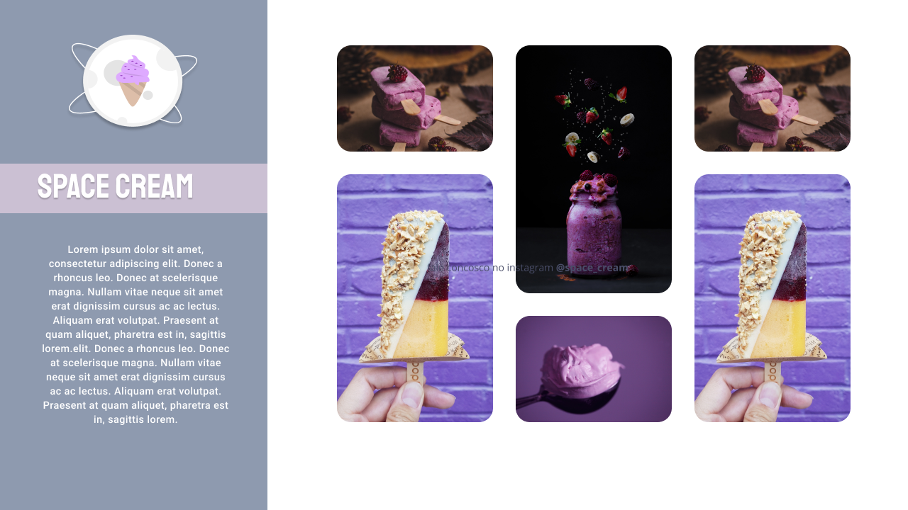

<h1 align="center"> Tela de exposição de produtos </h1>

Rocketseat, escola de desenvolvedores 

  <a href="#-tecnologias">Tecnologias</a>&nbsp;&nbsp;&nbsp;|&nbsp;&nbsp;&nbsp;
  <a href="#-projeto">Projeto</a>&nbsp;&nbsp;&nbsp;|&nbsp;&nbsp;&nbsp;
  <a href="#-layout">Layout</a>&nbsp;&nbsp;&nbsp;|&nbsp;&nbsp;&nbsp;
  <a href="#memo-licença">Licença</a>&nbsp;&nbsp;&nbsp;|&nbsp;&nbsp;&nbsp;
  <a href="#-doces">Doces</a>

  

 

  

## 🚀 Tecnologias

Esse projeto foi desenvolvido com as seguintes tecnologias:

- HTML e CSS
- Git e Github

## 💻 Descrição

Essa interface é uma tela com css avançado: grid, animação, responsividade e muito mais

- [Acesse o projeto finalizado, online](https://codepen.io/andresafernandes/pen/WNYRbJN)

## 🔖 Layout

Você pode visualizar o layout do projeto através [DESSE LINK](https://www.figma.com/file/3BkYqmykEOlnAHhQcalse4/Stage-03---Grid-com-anima%C3%A7%C3%B5es-(Copy)?type=design&node-id=0-1&mode=design&t=OjlZ4MT7tQX4Q7iN-0). É necessário ter conta no [Figma](https://figma.com/) para acessá-lo.

## :memo: Licença

Esse projeto está sob a licença MIT.

---

 Feito com ♥ Rocketseat :wave: [Acesse a comunidade!](https://www.rocketseat.com.br/)
